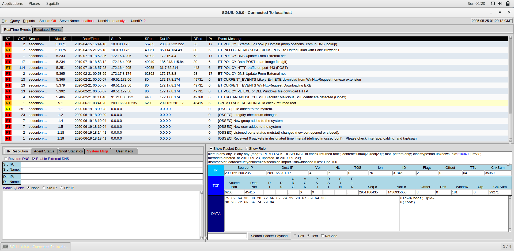
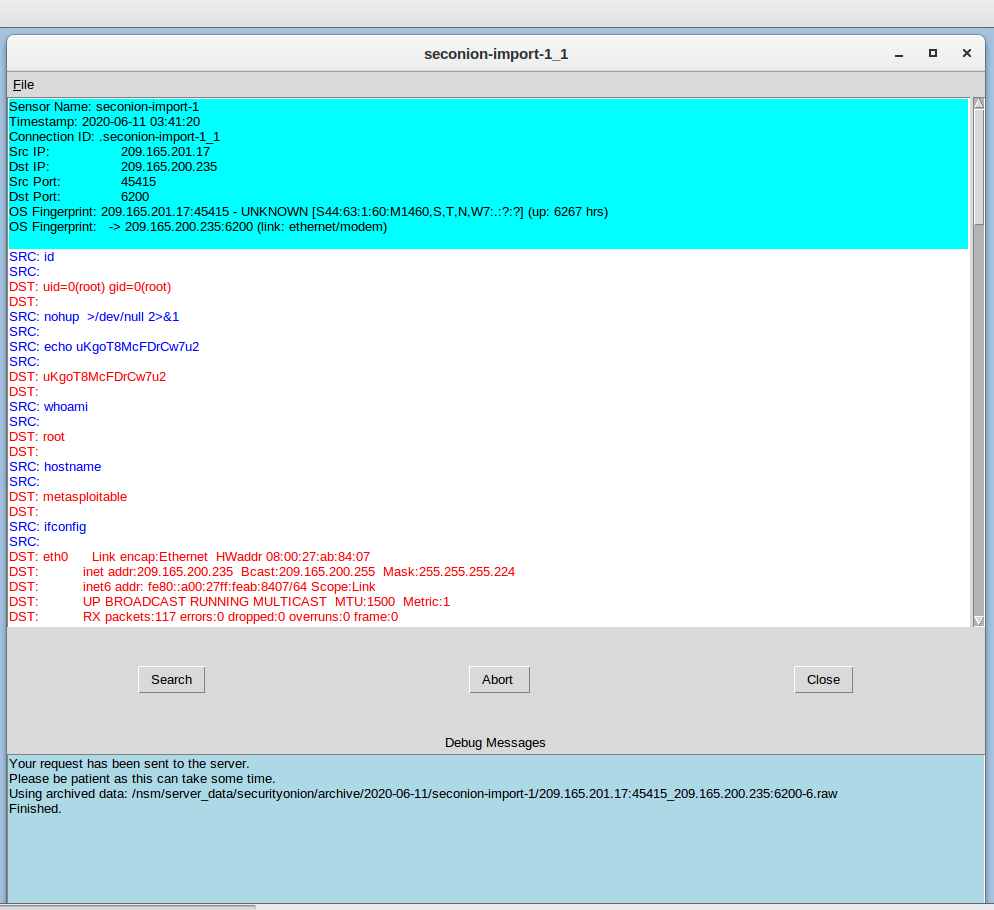
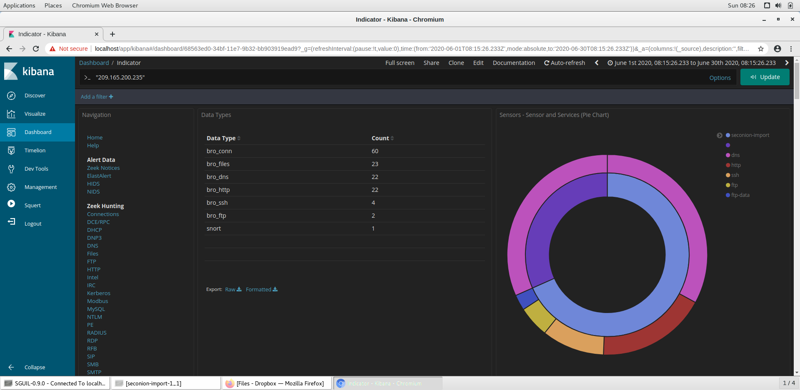
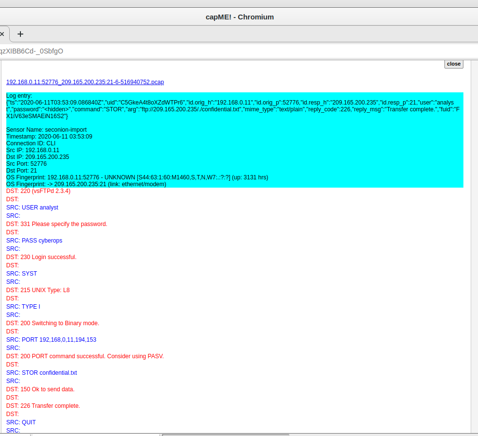
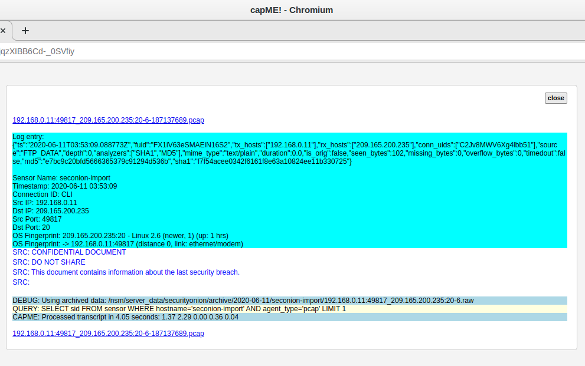

# FTP Data Exfiltration Detection (5-Tuple Correlation & Log Forensics)

A full SOC investigation simulating a real-world data exfiltration incident, conducted in a virtualized Security Onion lab environment. This project walks through the complete intrusion lifecycle, from initial alert triage to confirmed data exfiltration, using the same tools and correlation techniques SOC analysts use in production environments.

## Scenario

A compromised host on the network was used to exfiltrate a sensitive file (`confidential.txt`) via FTP. The investigation traces the attacker's actions from initial compromise through to the moment of data theft, using 5-tuple correlation (source/destination IP, ports, and protocol) to link evidence across multiple tools.

## Environment

- **VirtualBox** (Oracle): virtualization platform
- **Security Onion**: SOC/IDS platform (Sguil, Kibana, Zeek, CapMe)
- **Wireshark**: packet-level inspection
- **Ubuntu 64-bit**: host OS

## Investigation Walkthrough

**1. Alert Triage (Sguil)**
Reviewed real-time IDS alerts and flagged Alert ID 5.1 as suspicious. The alert showed evidence of returned root access between two unfamiliar hosts on an unusual port (6200), with a classtype of `bad-unknown`.

**2. Alert Validation (Sguil: Packet & Rule Inspection)**
Inspected the raw packet payload and triggered Snort rule to confirm the alert wasn't a false positive. The payload contained `uid=0(root) gid=0(root)`, confirming genuine root-level command execution rather than benign traffic.

**3. Transcript Analysis (Sguil)**
Reconstructed the attacker's session command-by-command. The attacker ran `id`, `whoami`, and `hostname` to confirm root access on a Metasploitable host, used `ifconfig` for network reconnaissance, then read `/etc/shadow` and `/etc/passwd`, and created a hidden backdoor account (`myroot`) to maintain persistent access.

**4. Packet-Level Validation (Wireshark)**
Pivoted to Wireshark to validate the session at the protocol level. Examined the TCP handshake, flag sequences (SYN, PSH/ACK, FIN/ACK), and window negotiation to confirm this was a structured, tool-driven interactive session rather than noise.

**5. TCP Stream Reconstruction (Wireshark)**
Followed the full TCP stream to recover the attacker's commands and the host's responses in sequence, corroborating the transcript findings with raw packet evidence.

**6. Log Correlation (Kibana)**
Pivoted into Kibana to correlate the timeline across protocols. Filtered logs to the attack window and reviewed Zeek-parsed traffic by data type. `bro_ssh` and `bro_ftp` entries stood out as the activity of interest.

**7. SSH Confirmation (Kibana: bro_ssh)**
Confirmed a successful SSH connection between the attacker and victim host, corroborating the root-level command execution already seen in the transcript and Wireshark analysis.

**8. FTP Exfiltration Evidence (Kibana: bro_ftp)**
Identified two FTP log entries showing a `STOR` command and a `confidential.txt` transfer between an internal host and the compromised machine, confirming the exfiltration channel.

**9. Session Recovery (CapMe)**
Opened the full FTP session transcript via CapMe, revealing the complete transaction: valid credentials (`USER analyst` / `PASS cyberops`), the `STOR confidential.txt` command, and a `226 Transfer complete` response confirming successful exfiltration.

**10. File Metadata & Content Recovery (Zeek Hunting + CapMe)**
Used Zeek's file-hunting view to confirm a single `FTP_DATA` transfer (102 bytes, `text/plain`), then traced the associated session in CapMe to recover the actual file contents, confirming the stolen document contained details of a prior security breach.

## Key Finding

The attacker gained root access via SSH, harvested credentials and account data from `/etc/shadow` and `/etc/passwd`, planted a persistent backdoor account, and exfiltrated a confidential file over an unencrypted FTP channel using valid stolen credentials. All of this is traceable end-to-end using 5-tuple correlation across IDS alerts, packet captures, and protocol logs.

## Mitigation Recommendations

- Revoke and reset all compromised credentials
- Replace FTP with SFTP to encrypt data in transit
- Restrict access to non-standard/sensitive ports via firewall rules
- Implement multi-factor authentication (MFA)
- Conduct a full forensic sweep for additional backdoors or persistence mechanisms

## Skills Demonstrated

- IDS alert triage and validation (Sguil, Snort rules)
- Packet and protocol analysis (Wireshark, TCP stream reconstruction)
- Log correlation across multiple data sources (Kibana, Zeek)
- Session/forensic reconstruction (CapMe)
- End-to-end incident investigation using the 5-tuple correlation method

## Full Report

Key evidence is shown inline above. The complete walkthrough, including every step, all tool views, and full analysis narrative, is available in the [full technical report](Technical%20Project%20Report%20(Lab%2027.2.14).pdf)
