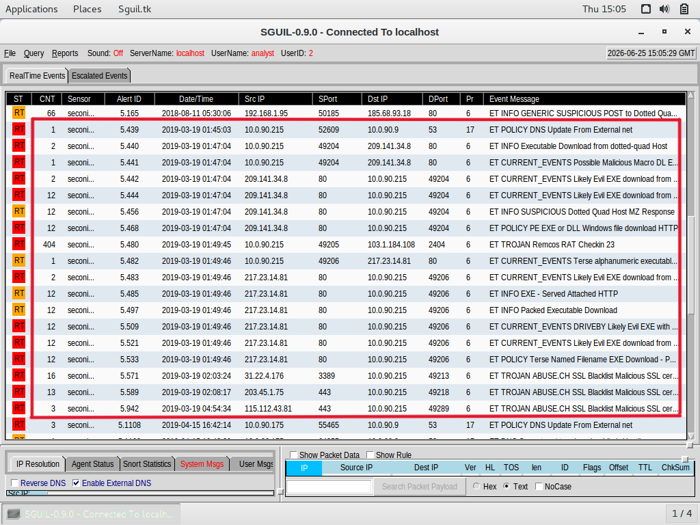
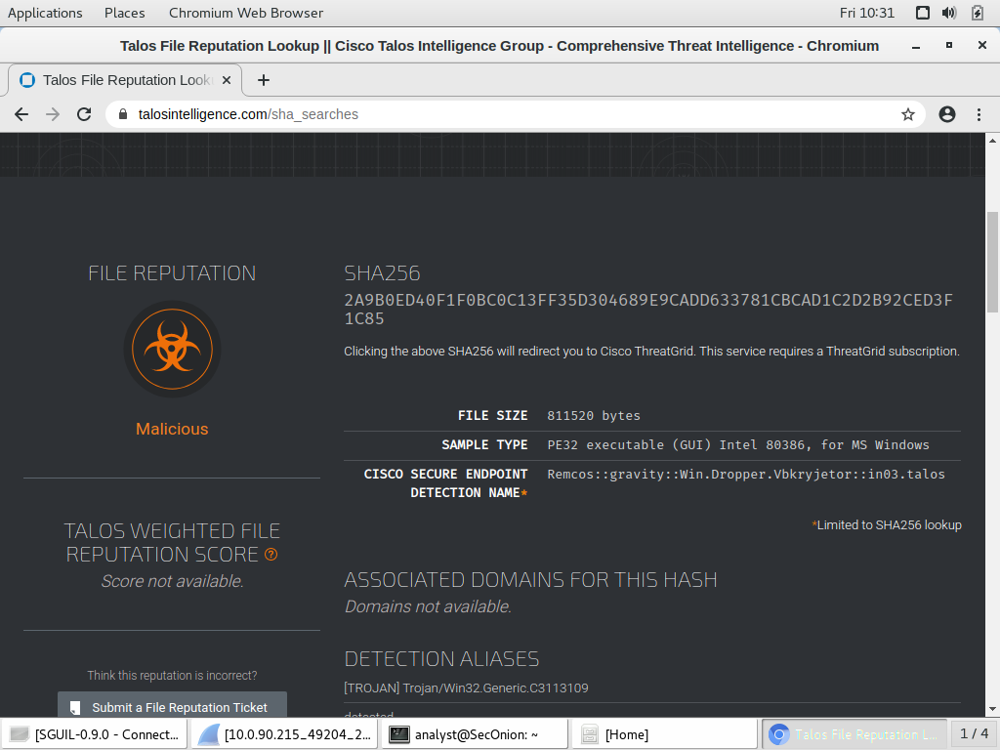
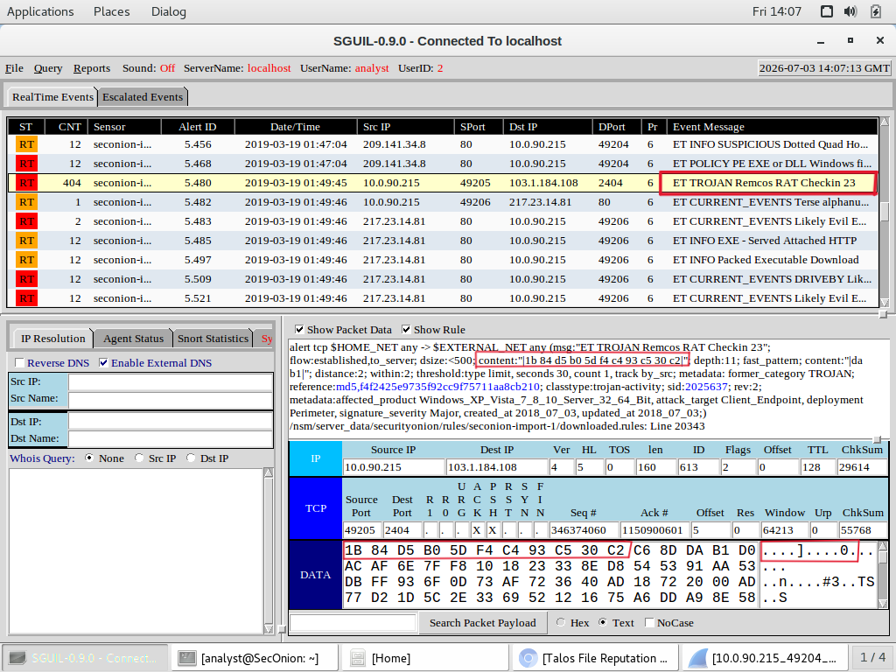
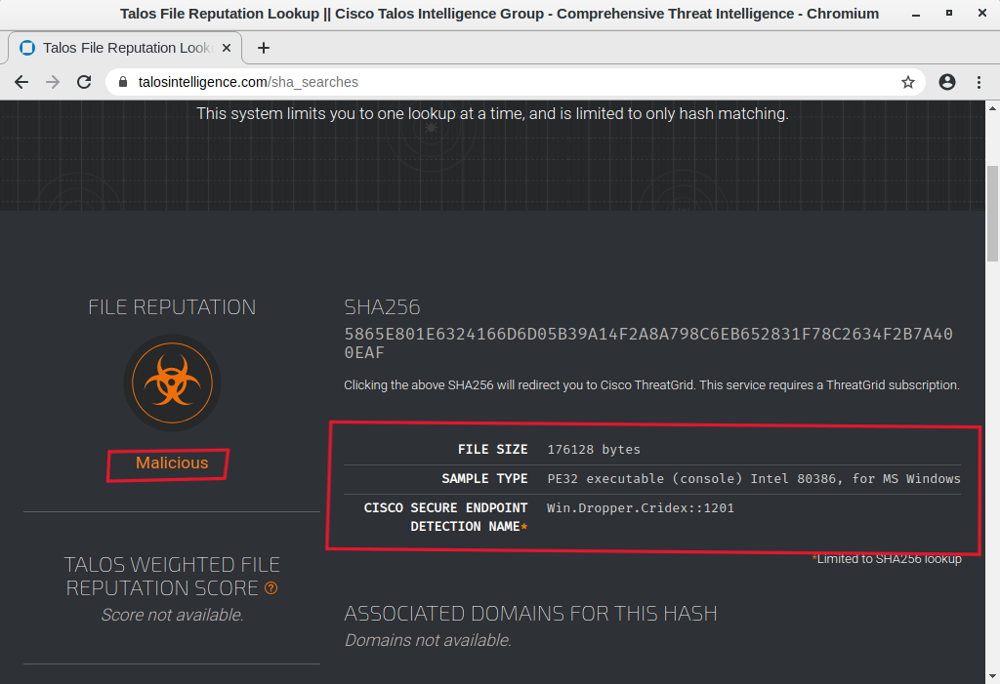
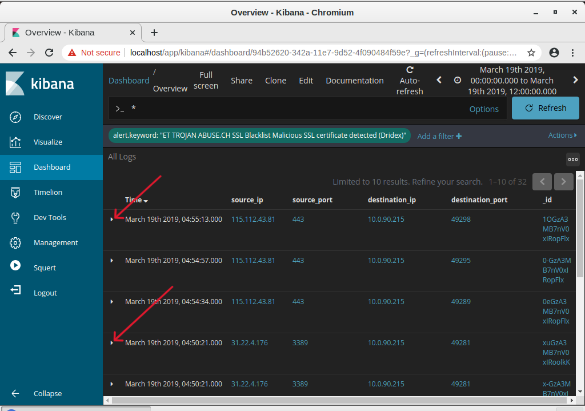
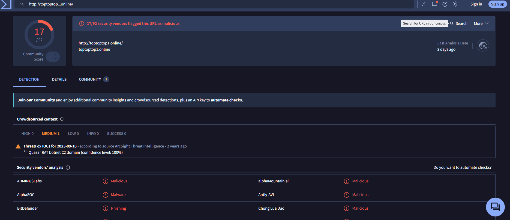

# Windows Host Malware Investigation: Remcos RAT, Cridex, and Quasar RAT

A full SOC investigation into a Windows host infected with three separate malware families in a single attack. Conducted in a virtualized Security Onion lab environment, this project traces the infection from the first suspicious DNS alert through to confirmed remote access trojan activity, banking credential theft malware, and a botnet command and control channel, using Sguil, Wireshark, and Kibana together to build the full picture.

## Scenario

On 19 March 2019, a Windows host triggered a cluster of automated IDS alerts. The investigation set out to answer three questions: what time did the attack happen, which host and user were affected, and what malware was actually responsible.

## Environment

- **VirtualBox** (Oracle): virtualization platform
- **CyberOps Security Onion**: SOC/IDS platform (Sguil, Kibana, Wireshark)
- **Ubuntu 64 bit**: host OS

## Investigation Walkthrough

**1. Alert Triage (Sguil)**
Located the full cluster of alerts from 19 March 2019. The first and last alerts spanned just over three hours, but most activity was packed into a 20 minute window, a pattern consistent with automated, scripted malware behavior rather than manual activity.

**2. Initial Compromise: DNS Registration**
The first alert flagged a DNS update from the infected host. Pivoting to Wireshark confirmed the host, Bobby-Tiger-PC, was registering itself under the domain littletigers.info, an early sign the machine was already talking to attacker controlled infrastructure.

**3. First Payload: Remcos RAT**
The next alert showed an executable, test1.exe, being downloaded over HTTP. I exported the file directly from Wireshark, generated its SHA256 hash, and submitted it to Cisco Talos.

Talos identified the file as Remcos, a Remote Access Trojan. Minutes later, an alert with a count of 404 confirmed the malware was actively checking in with its command and control server.

**4. Second Payload: Cridex Banking Trojan**
A second executable, f4.exe, was identified being downloaded from a different external IP. The same export, hash, and Talos lookup process confirmed this file as a Cridex dropper, a banking trojan built to steal financial credentials.

**5. Command and Control Infrastructure (Kibana)**
Correlating the attack timeline in Kibana surfaced three additional encrypted connections, all flagged by the same SSL blacklist signature tied to Dridex. Expanding each log entry revealed the geographic spread of the attacker's infrastructure.

The three servers traced back to Newcastle upon Tyne (UK), Mount Waverley (Australia), and Mumbai (India), suggesting redundant C2 channels designed to survive a single takedown or block.

**6. A Third Malware Family: Quasar RAT**
Reviewing the full DNS query history surfaced a domain that hadn't appeared anywhere else in the investigation, toptoptop1.online. A VirusTotal lookup confirmed it as malicious.

Seventeen of ninety two security vendors flagged the domain, and threat intelligence identified it with full confidence as Quasar RAT botnet infrastructure, a third distinct malware family operating on the same host.

## Key Finding

This wasn't a single piece of malware. One Windows host was compromised by three separate threats at once: Remcos RAT giving the attacker direct remote access, Cridex quietly harvesting financial credentials, and Quasar RAT running as a third command and control channel. Each was delivered and identified independently, but all three were active on the same machine during the same window of time.

## Mitigation Recommendations

- Isolate the infected host immediately to cut off all active command and control channels
- Reset all credentials used on the machine, given Cridex's credential harvesting capability
- Block the identified malicious domains and IPs at the firewall and DNS level
- Deploy endpoint detection capable of catching all three malware signatures directly
- Restrict or disable WPAD unless explicitly required, since it is a common interception vector
- Capture a full forensic disk image before remediation to preserve evidence of any additional persistence

## Skills Demonstrated

- Multi tool threat correlation across Sguil, Wireshark, and Kibana
- File extraction, hashing, and threat intelligence lookup using Cisco Talos and VirusTotal
- DNS and HTTP traffic analysis to separate malicious activity from legitimate Windows background traffic
- Malware family identification and attribution (Remcos RAT, Cridex, Quasar RAT)
- Geolocation based infrastructure analysis of command and control servers
- Incident investigation structured around the Cyber Kill Chain

## Full Report

Key evidence is shown inline above. The complete walkthrough, including every step, all seven confirmed alerts, and the full analysis, is available in the [full technical report](Windows_Malware_Investigation_Report.pdf).
